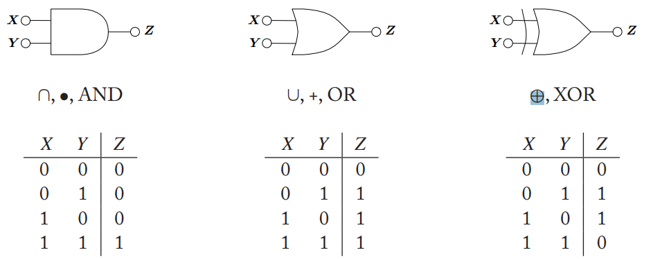
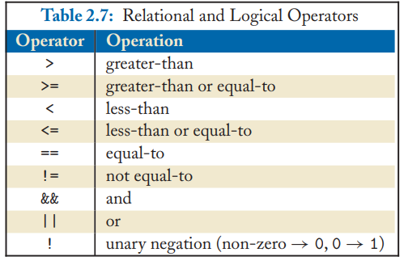
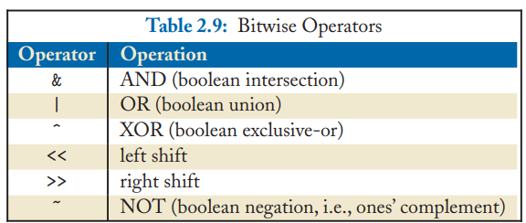
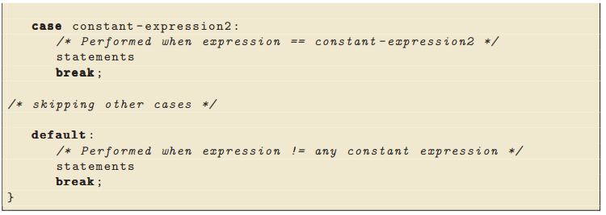

### Wiki: 

>> **return 0 ;** It is a indicator that program succeeded, done by ***exit status***

>> **Compiling** : ```gcc -o hii hello.c -Wall ```
- -o enable you to name the complied file
- -Wall enable you to be warned about the suspicious code
- To run: ./

>> **Statement**: are the text that will be turned into executable instructions. 
- ``int i = 3;``
- ";" has to be placed at the end of statement

>> **Whitespace** it surrounds the statements to organize the code which is ignored by the compiler.

>> **Scope** : There 2 types of scope
-*** Local Scope***: can be manipualted only within the block it was declerad
- **Glocal Scope:** can be manipulated from anywhere in the program.

>> **Functions** : special block that performs a well-defined task. It usually returns a value to the caller.

>> **Compiling** : It is basically a native compiler read every source code and translate everthing into machine code that is comprehensible to a microprocessor.
- It comes with 2 problem. 
- 1. in the large project the compuler may not have enought memory to read all the source code.
- 2. If you make a change in a single source code you have to recompile the entire application.
- Solution: Use of Object Files and Linker.
- **Object File:** occurs when each .c file is translated into machine code with its references (#include)
- **Linker** collects all the objects files and writes a actual program. If you can change only a file, then only that file needs to be re-compiled and re-linked.


>> **Preprocessor** : Directive instruct a part of the compiler the to modify the code written before it is compiled. For example: it is used in #include <stdio.h> or functions that are used after main().

>> **Line Breks:** : After precompiler declerations. After new variable are declared.

>> **Indentation** : Every conde inside a block should be intended

>> **Comments**
```- // Single line comment```
- /* Multi 
- line   
- comment*/

>> **Data Type Modifiers**
- short: 2 bytes, -32.768 bis +32.767. 2 to the power of 16
- int: 4 bytes
- long: 8 bytes

>> **const** : are read-only variables , must be initialized at decleration and not allowed to be changed.
- Therefore, some compiler can optimize 
- ```const data_type var_name = value;```
-  ```const int name = 5;```
-  ```const char letter = 'A';```

>> **#define** L 


### Digital Logic Fundatmentals


### Big-Endian vs Little-Endian
Suppose you are given {N}2 = (00100110) but not told the order. The meaning of the bit string could be either Nbig-endian = 32 or Nlittle-endian = 100.

### Representing negative values in Binary
**Two's Complement**: Let n = 8. The representation for 77 is (01001101), just like in all other cases. To get -77 in the two’s complement code, we negate the number, which means we invert all the bits and add 1, so (10110011).


## ANSI C
- If we write software using only ANSI C, then it will build to run on any target platform with ANSI C compiler.
- Every microprocessor has its own unique set of machine instructions

Goals of a software project should be to place as much code into the Application Layer as possible to reduce the amount of effort necessary for porting code to other platforms.


### Conversation Characters and Interpretations


### Formatted Printing Character Constants


### Standart and Unsigned Integer C Types


### Decimal Constant Values in statements


### Logical Operations


### Bit-Wise Operations


### Difference between Logical and Bitwise Operations


### Assigment Operators


## Conditional Expression
### IF ELSE IF


### SWTICH-CASE




## LOOPS
expression1 is an initialization assignment (e.g., i=0)
expression2 is some ending condition (e.g., i < MAGIC_NUMBER).
expression3 is an increment (e.g., i += MAGIC_INCREMENT, or i++).

### For


### While


### Do - While
The do-while loop presented in Ex. 2.37 repeats statement as long as expression != 0. A nice
feature of this loop style is that statement is always executed at least once prior to the expression
evaluation.


## Infinite Loops
Loops that repeat execution “forever” are called infinite loops. You might be wondering why such a
construct exists, as once the algorithm enters an infinite loop it doesn’t exit (until execution is halted
by outside force). However, an infinite loop is a very important and fundamental concept necessary
to many applications
Embedded applications
are fundamentally the same. Imagine how useless an alarm clock that didn’t sit in an infinite loop
would be.


Arduino Integrated Development Environment (IDE) hides the
main() function from the engineer. Instead, they present the two functions setup() and loop(),
which allow the developer to initialize various conditions, and then loop forever. For example, the
text in Ex.2.41 is an Arduino-based “Hello world” program as viewed through the IDE

### Miscelalaneous : DON’T USE
The following are a part of ANSI C but should “never” be used for the sake of maintainable code

### Break
A break allows for the early exit from a loop. It is useful (and actually required for maintainable
code) within a switch statement so the code in subsequent cases is not executed.
Example 2.43 After the loop executes in this example, i == 5 and x == 4.


### Continue
A continue is similar to break in that when executed the remaining code in the loop block is
skipped. However, it differs from break in that the loop continues to execute.
Example 2.44 After the loop executes in this example, i == 10 and x == 4


### Scope Rules
It is considered good coding practice to make global functions and variables available via
header files, as example below:

Then other files will use this header  file to communicate global information to each other, When other files A or B contain the following code 
fileA 
    #include include include "fileC.h"

fileB
    #define _FILE_B
    #include include include "fileC.h"
By placing the #define _FILE_B in fileB.c before the header file is included, it causes the
preprocessor to define a blank macro. This causes the compiler to allocate the necessary memory for
variable x. fileA.c simply includes the header file without defining anything, and so x is declared
as an external variable within that file.

>> The keyword **static**  limits the scope of a global variable to just within the file declaring it.
<<<<<<< HEAD
Below, in the first call to the test() function initiliazes i == 0,
In the next call it is not re-initiliazed to zero, instead, it cointains the value it had when the function exited previosly (i.e: 1).


### Example Coding Convention Rules


### Variable keywords
>> register int x ; 
Meaning, advises compiler that variable will be accesed a lot and should be placed in machine register
>> volatile int x ;
Meaning, so it can be useful when you want to trick compiler into preserving some statements that you dint want removed. Compiler is then unable to optimize certain statements due to memory caching


 
=======

## Pointers and Arrays
Pointer contain an address usually of an another variable
**To Define** a pointer 
'p = &c;'
Now p is the adress of the "c"


**To Declare** 
'char *p'
'short *q'
'long *r'
Pointers can be created for many types such as (to other pointers, to functions, to any type of array, to structre type)

```
short *p;
short a[10];

p = &(a[2]);

/* followings are correct*/
*(p) = a[2];
*(p+1) = a[3];

```

## Compiling
```
gcc -o hi.c hi -Wall
```
>> -o : allows to give a name to the compiled c program, otherwise default it named as "a"
>> -Wall : indicated that gcc should warn about many types of suspicious code that are likely to be incorrect

## Dynamic Memory Allocation
We can dynamically allocate memory at run-time and have the base be referred via pointer.
That means compiler doesnot reverse the consecutive bytes of memory as for am array decleration. 
Instead, CPU is directed to find a block of consecitive bytes in memory that are not being used dand return the base address.
>> malloc : Allocates size bytes of uninitilialized (garbage value) storage
>> calloc : Allocates memory for an array of num objects of size and initializes all bytes to 0
>> free : De-allocates previously allocated memory

**! Warning** : If you don't "free" the dynamic memory, it causes *"memory leak"* which means repeated call to the function will consume all of the available memory, then program crashes.

**! Warning** : Run-Time Allocation is not the best practice in embedded programs since even in PC applications, with all of the powerful debugging tools, it is still hard to track down the *leaks*. Embedded systems tools are quite limited and mostly debugging an embedded memory is exceptionally diffucult.

```
#include <stdio.h>   
#include <stdlib.h> 
 
int main(void) 
{
    int *p1 = malloc(4*sizeof(int));  // allocates enough for an array of 4 int
    int *p2 = malloc(sizeof(int[4])); // same, naming the type directly
    int *p3 = malloc(4*sizeof *p3);   // same, without repeating the type name
 
    if(p1) {
        for(int n=0; n<4; ++n) // populate the array
            p1[n] = n*n;
        for(int n=0; n<4; ++n) // print it back out
            printf("p1[%d] == %d\n", n, p1[n]);
    }
 
    free(p1);
    free(p2);
    free(p3);
}
```

### Multi-Dimensional Arrays
```
#define MAX_ROWS 2
#define MAX_COLS 3

const short table[MAX_ROWS][MAX_COLS] = {
    {1,2,3,4,5},
    {6,7,8,9,10}
};

Followings are true:
table[0][1] == 2;
table[1][4] == 10;


```
**Decleration**
```
return_type (* variableName)(argument_list);
```

Ex:
```
int (*comp) (void*, void*) ;
char * (* weird) (void) ;
```
>> Variable ***comp*** is a pointer to a function that returns an ***int*** and takes ***two generic pointers***
>> Variable ***weird*** is a pointer to a function that returns an ***char pointer*** and takes ***no arguments***

## Structure
Collection of one or more variable, possible of different types grouper together under a single name for convenient handling.
Similar to "classes" in C++

Definition/Notation
```
struct TagPoint
{
    int x;
    int y;
}
```
**Build a Structure with another Structure**
```
struct TagRectangle{
    struct TagPoint upperLeft;
    struct TagPoint lowerRight;
};

struct TagRectangle polygon;
polygon.upperLeftCorner.x = 320;