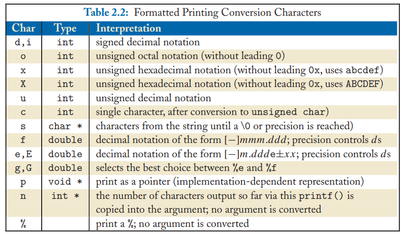

### Digital Logic Fundatmentals

### Big-Endian vs Little-Endian
Suppose you are given {N}2 = (00100110) but not told the order. The meaning of the bit string could be either Nbig-endian = 32 or Nlittle-endian = 100.

### Representing negative values in Binary
**Two's Complement**: Let n = 8. The representation for 77 is (01001101), just like in all other cases. To get -77 in the two’s complement code, we negate the number, which means we invert all the bits and add 1, so (10110011).

## ANSI C
- If we write software using only ANSI C, then it will build to run on any target platform with ANSI C compiler.
- Every microprocessor has its own unique set of machine instructions

Goals of a software project should be to place as much code into the Application Layer as possible to reduce the amount of effort necessary for porting code to other platforms.

### Conversation Characters and Interpretations

### Formatted Printing Character Constants

### Standart and Unsigned Integer C Types

### Decimal Constant Values in statements

### Logical Operations

### Bit-Wise Operations

### Difference between Logical and Bitwise Operations

### Assigment Operators

## Conditional Expression
### IF ELSE IF

### SWTICH-CASE

## LOOPS
expression1 is an initialization assignment (e.g., i=0)
expression2 is some ending condition (e.g., i < MAGIC_NUMBER).
expression3 is an increment (e.g., i += MAGIC_INCREMENT, or i++).

### For

### While

### Do - While
The do-while loop presented in Ex. 2.37 repeats statement as long as expression != 0. A nice
feature of this loop style is that statement is always executed at least once prior to the expression
evaluation.

## Infinite Loops
Loops that repeat execution “forever” are called infinite loops. You might be wondering why such a
construct exists, as once the algorithm enters an infinite loop it doesn’t exit (until execution is halted
by outside force). However, an infinite loop is a very important and fundamental concept necessary
to many applications
Embedded applications
are fundamentally the same. Imagine how useless an alarm clock that didn’t sit in an infinite loop
would be.

Arduino Integrated Development Environment (IDE) hides the
main() function from the engineer. Instead, they present the two functions setup() and loop(),
which allow the developer to initialize various conditions, and then loop forever. For example, the
text in Ex.2.41 is an Arduino-based “Hello world” program as viewed through the IDE

### Miscelalaneous : DON’T USE
The following are a part of ANSI C but should “never” be used for the sake of maintainable code

### Break
A break allows for the early exit from a loop. It is useful (and actually required for maintainable
code) within a switch statement so the code in subsequent cases is not executed.
Example 2.43 After the loop executes in this example, i == 5 and x == 4.

### Continue
A continue is similar to break in that when executed the remaining code in the loop block is
skipped. However, it differs from break in that the loop continues to execute.
Example 2.44 After the loop executes in this example, i == 10 and x == 4

### Scope Rules
It is considered good coding practice to make global functions and variables available via
header files, as example below:

Then other files will use this header  file to communicate global information to each other, When other files A or B contain the following code 
fileA 
    #include include include "fileC.h"

fileB
    #define _FILE_B
    #include include include "fileC.h"
By placing the #define _FILE_B in fileB.c before the header file is included, it causes the
preprocessor to define a blank macro. This causes the compiler to allocate the necessary memory for
variable x. fileA.c simply includes the header file without defining anything, and so x is declared
as an external variable within that file.
>> The keyword **static**  limits the scope of a global variable to just within the file declaring it.

## Pointers and Arrays
Pointer contain an address usually of an another variable
**To Define** a pointer 
'p = &c;'
Now p is the adress of the "c"

**To Declare** 
'char *p'
'short *q'
'long *r'
Pointers can be created for many types such as (to other pointers, to functions, to any type of array, to structre type)